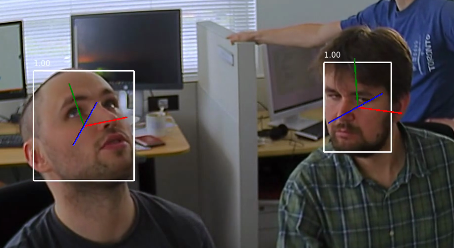

# OpenVINOを使った視線推定の手順

## 1. 視線推定の流れ

全体として動画データを入力して、視線推定結果を描画した出力をします。 動画はフレームごとに分けられて、以下のような流れで視線推定を行います。
```
顔検出
↓
顔検出結果からランドマーク(目、鼻、口、眉毛、輪郭)推定
↓
顔検出結果から頭部姿勢推定
↓
ランドマーク推定と頭部姿勢推定結果から視線推定
```
次に、それぞれの工程について簡単に説明します。
### 2.1 顔検出

- 入力:(B(バッチサイズ), C(チャンネル数), H(画像の高さ), W(画像の幅))
- 出力:(1(バッチ数), 1(クラスの次元数), N(bbox数), 7(各検出))


各検出は [image_id, label, conf, x_min, y_min, x_max, y_max]のようになっており、x,yは正規化座標です。
正規化とは x / W(幅) , y / H(高さ)です。
- image_id : バッチ内の画像の ID
- label : 予測されたクラス ID (1=顔)
- conf : 予測されたクラスの信頼度
- (x_min, y_min) : 境界ボックスの左上隅の座標
- (x_max, y_max) : 境界ボックスの右下隅の座標

### 2.2 ランドマーク推定
ランドマーク推定は顔検出の結果のx_min, y_min, x_max, y_maxを使用して顔の部分だけを入力して推定を行います。
これをROI(Region of Interest)とは関心領域といい、注目して処理や分析を行いたい部分を指します。

入力:(B(バッチサイズ), C(チャンネル数), H(顔ROIの高さ), W(顔ROIの幅))
出力:(1,70) 35個のランドマーク(x,y)が正規化されて出力されます。


- 左目:p0,p1
- 右目:p2, p3
- 鼻:p4-p7
- 口:p8-11
- 左眉毛:p12-p14
- 右眉毛:p15-17
- 顔の輪郭:p18-p34

### 2.3 頭部姿勢推定
入力:(B(バッチサイズ), C(チャンネル数), H(顔ROIの高さ), W(顔ROIの幅))
出力: yaw(度), pitch(度), roll(度)

yaw,pitch,rollとは頭の向きを3つに分解し数値化したもので簡単にいうと下記のようになります。
- yaw: 首を左右に振る動き カメラ視点で右を向くと＋
- pitch:首を上下に降る動き カメラ視点で下を向くと＋
- roll:首を傾ける動き カメラ視点で右肩が上がると＋

### 2.4 視線推定
ランドマーク推定で得た左右目の座標と頭部視線推定の結果から視線推定を行います。
- 入力:左右目ORI, 頭部推定結果
- 出力: 正規化していない視線ベクトル(x, y, z)

出力の視線描画は2次元なためx,yしか使いません。

## 3. コードの動かし方

Dockerを使って簡単に動かせるようにしました。
今回使用したモデルは下記になります。

- 顔検出:face-detection-adas-0001
- ランドマーク推定:facial-landmarks-35-adas-0002
- 頭部姿勢推定:head-pose-estimation-adas-0001
- 視線推定:gaze-estimation-adas-0002

### 3.1 準備
#### step1
リポジトリをクローン
```
git clone https://github.com/kohei-kikuchi-11/gaze_estimation.git
```
#### step2
視線推定を行いたい動画をinputディレクトリに格納します。

### 3.2 実行
下記コマンドを実行する。自前の動画を使用する場合はrun.shのinputパスを書き換えて実行する。
```
bash run.sh input/36510_1280x720.mp4
```

出力動画は下記のように顔bboxと左右目bboxが緑、ランドマークが黄色、、頭部姿勢yaw,pitch,rollが赤、視線が青で表されます。


## 4. 参考ページ

- [視線推定デモ](https://www.isus.jp/wp-content/uploads/openvino/2024/docs/omz_demos_gaze_estimation_demo_cpp.html#demo-output)
- [face_detection_adas_0001](https://www.isus.jp/wp-content/uploads/openvino/2024/docs/omz_models_model_face_detection_adas_0001.html)
- [facial_landmarks_35_adas_0002](https://www.isus.jp/wp-content/uploads/openvino/2024/docs/omz_models_model_facial_landmarks_35_adas_0002.html)
- [head_pose_estimation_adas_0001](https://www.isus.jp/wp-content/uploads/openvino/2024/docs/omz_models_model_head_pose_estimation_adas_0001.html)
- [gaze-estimation-adas-0002](https://www.isus.jp/wp-content/uploads/openvino/2024/docs/omz_models_model_gaze_estimation_adas_0002.html)